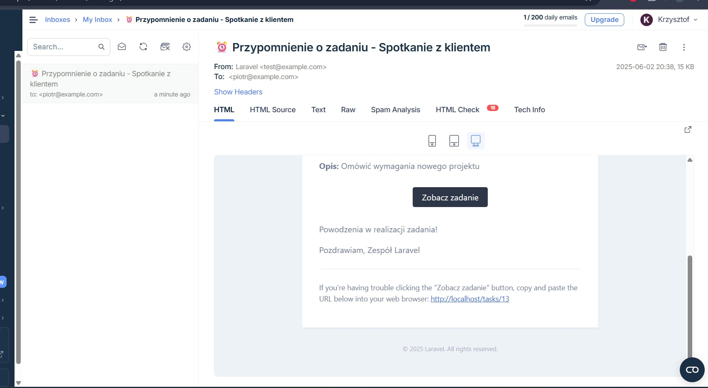

## 🎯 **Wymagania Funkcjonalne - Realizacja**

### ✅ **1. CRUD Zadań**
**Wymaganie**: Pełne operacje CRUD na zadaniach z polami: nazwa, opis, priorytet, status, termin
- ✅ Create - formularz tworzenia z walidacją
- ✅ Read - lista zadań + szczegóły
- ✅ Update - edycja wszystkich pól  
- ✅ Delete - usuwanie z potwierdzeniem
- ✅ Wszystkie wymagane pola zaimplementowane

### ✅ **2. Filtrowanie Zadań**
**Wymaganie**: Filtrowanie według priorytetów, statusu i terminu
- ✅ Filtr po statusie (to-do, in progress, done)
- ✅ Filtr po priorytecie (low, medium, high)
- ✅ Filtr po zakresie dat (od-do)
- ✅ Kombinowanie filtrów
- ✅ Szybki filtr przeterminowanych

### ✅ **3. Powiadomienia E-mail**
**Wymaganie**: E-mail na 1 dzień przed terminem, Queues + Scheduler
- ✅ Laravel Notifications - TaskReminderNotification
- ✅ Queue system - Redis backend
- ✅ Scheduler - cron job `tasks:send-reminders`
- ✅ Mailtrap integration - testowanie maili
- ✅ Background processing

### ✅ **4. Walidacja**
**Wymaganie**: Poprawna walidacja formularzy
- ✅ Request classes - StoreTaskRequest, UpdateTaskRequest
- ✅ Frontend validation - real-time feedback
- ✅ Wymagane pola, limity znaków, format daty
- ✅ Error handling z komunikatami

### ✅ **5. Multi-user System**
**Wymaganie**: Uwierzytelnianie + zarządzanie własnymi zadaniami
- ✅ Laravel Breeze - rejestracja, logowanie, reset hasła
- ✅ User ownership - każdy widzi tylko swoje zadania
- ✅ Middleware auth - ochrona tras
- ✅ Profile management

### ✅ **6. Udostępnianie Zadań (Token Links)**
**Wymaganie**: Publiczne linki z tokenami + ograniczony czas
- ✅ Generowanie unikalnych tokenów
- ✅ Konfigurowalny czas wygaśnięcia 
- ✅ Publiczny dostęp bez logowania
- ✅ UI do generowania linków
- ✅ Copy to clipboard

---

## 🏗️ **Wymagania Techniczne - Realizacja**

### ✅ **Backend: Laravel 11**
- ✅ REST API - pełne API endpoints
- ✅ Eloquent ORM - models z relacjami
- ✅ MySQL database - migracje i seeders
- ✅ Queue system - Redis + background jobs
- ✅ Scheduler - automated tasks

### ✅ **Frontend: Laravel Blade**
- ✅ Responsive UI - Tailwind CSS
- ✅ Interactive features - Alpine.js + AJAX
- ✅ Real-time updates - bez page reload
- ✅ Mobile-friendly design

### **Docker **
- ⚠️ **Status**: Przygotowany, działa na docker for windows , nie jestem pewny czy zadziała na linux czy czegoś mu nie brakuje w konfiguracji

## 🐳 **Docker Status**

### ✅ **Co zostało przygotowane:**
- Kompletny docker-compose.yml (7 serwisów)
- Dockerfile z PHP 8.2 + extensions
- Nginx configuration
- Environment setup
- Volume mapping

## 📊 **Podsumowanie**

### ✅ **Wykonane zostały wszystkie podpunkty wraz z opcjonalnymi, podpunktami dotyczącym historii zadania oraz konteneryzacji do docker:**
