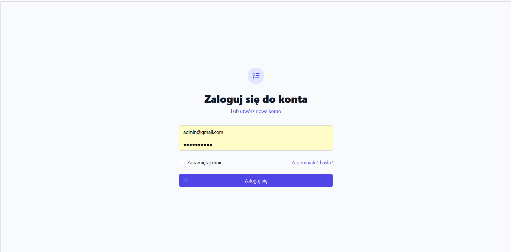
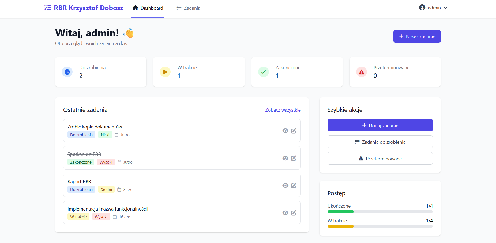
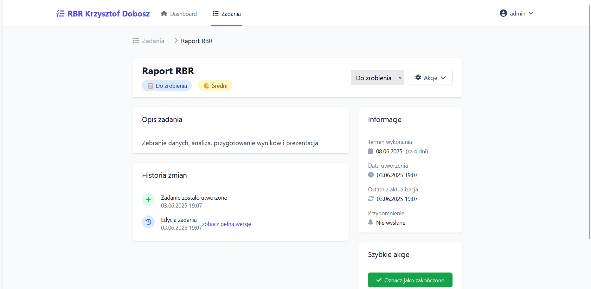
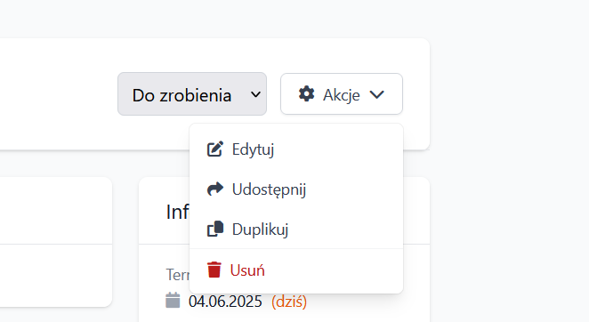
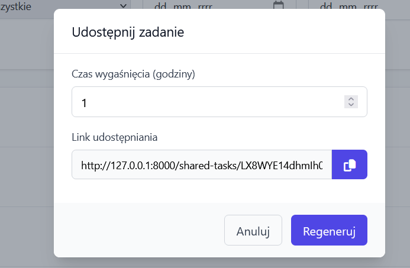
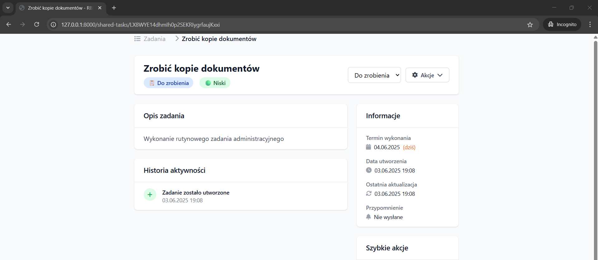
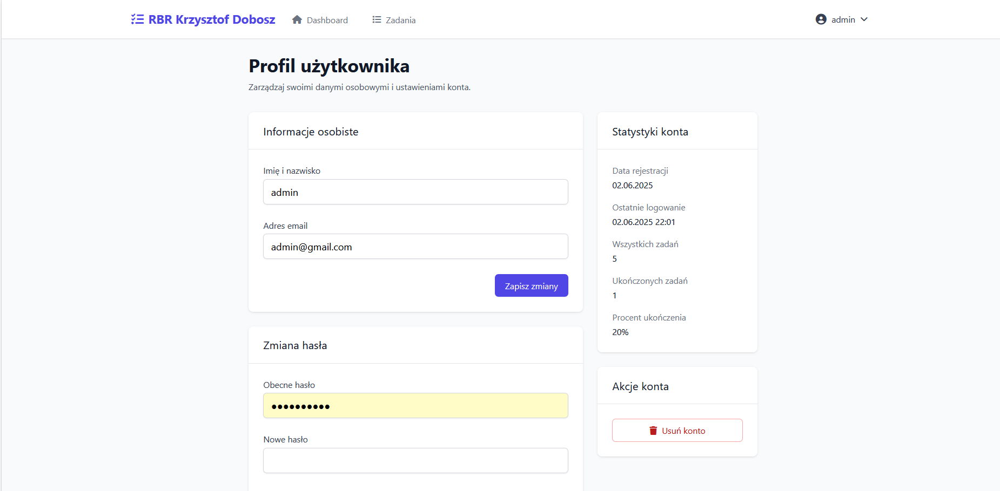

Jak uruchomić projekt?
----------------------
1. Skopiuj plik `.env.example` do `.env` i uzupełnij niezbędne dane.  
2. Uruchom instalację zależności aplikacji:
```sh
composer install
```
   Zobacz [composer.json](composer.json).  
3. Wygeneruj klucz aplikacji i wykonaj migracje:
```sh
php artisan key:generate
php artisan migrate
```
   Zobacz [artisan](artisan).  
4. Zainstaluj zależności frontendu:
```sh
npm install
npm run dev
```
5. Uruchom serwer lokalny:
```sh
php artisan serve
```
## Konfiguracja maili
Projekt korzysta z Mailtrap w pliku `.env`, np.:
```
MAIL_MAILER=smtp
MAIL_HOST=smtp.mailtrap.io
MAIL_PORT=2525
MAIL_USERNAME=...
MAIL_PASSWORD=...
MAIL_ENCRYPTION=tls
```
Zobacz [config/mail.php](config/mail.php).

## Uruchamianie workerów
Aby wysyłać maile w tle, uruchom:
```sh
php artisan queue:work
```
## wysłanie maili natychmiastowo
```sh
php artisan tasks:send-reminders
```

Zrzuty ekranu 






